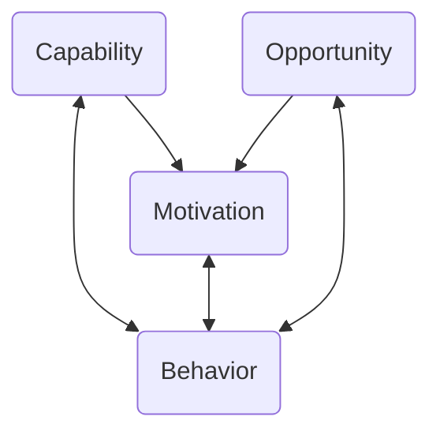
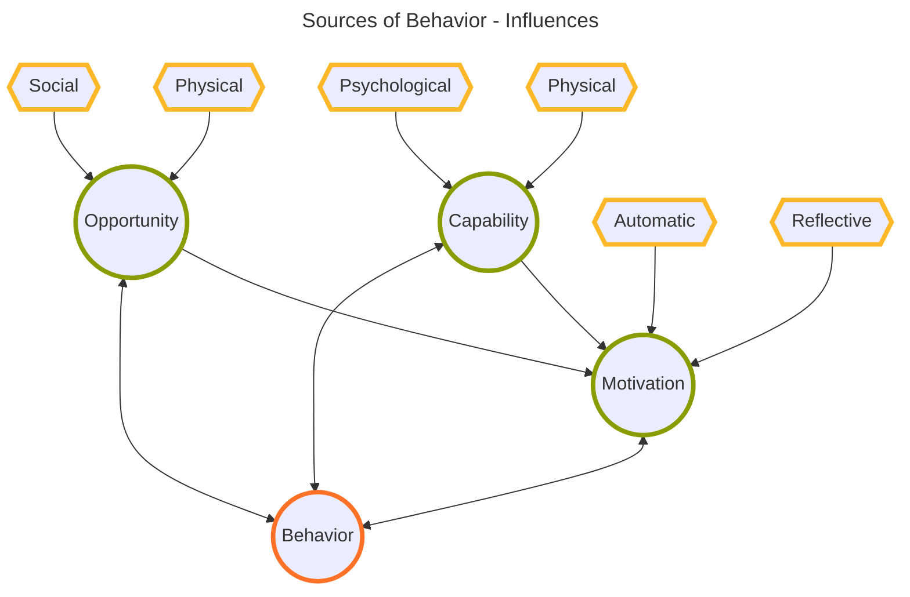

> [!info] This is a Literature Note
> Michie, Susan, et al. “The Behaviour Change Wheel: A New Method for Characterising and Designing Behaviour Change Interventions.” _Implementation Science_, vol. 6, no. 1, Dec. 2011, p. 42. _DOI.org (Crossref)_, [https://doi.org/10.1186/1748-5908-6-42](https://doi.org/10.1186/1748-5908-6-42).

The authors establish a framework for designing [[behavior change intervention]].

They introduce the COM-B system which links Capability, Motivation, and Opportunity to each other and each in turn to Behavior.

| Source      | Aspect        | Achieved by                                              | Examples                                  |
| ----------- | ------------- | -------------------------------------------------------- | ----------------------------------------- |
| Capability  | Physical      | physical skill development                               | training, prostheses, surgery             |
| Capability  | Psychological | knowledge, understanding                                 | skill learning, meds                      |
| Motivation  | Automatic     | positive/negative feelings, impulses, and counter-pulses | habit formation, meds, imitative learning |
| Motivation  | Reflective    | eliciting positive/negative feelings                     | imparting knowledge                       |
| Oppertunity | Social        |                                                          | environment change                        |
| Oppertunity | Physical      |                                                          | environment change                        |

The article presents a set of intervention categories and a set of  policy categories that can be used to influence the sources mentioned. A given policy or intervention may affect one or more of the sources that influence behavior.  

| Intervention                | Example or Elaboration                                              |
| --------------------------- | ------------------------------------------------------------------- |
| Education                   | Public service announcements                                        |
| Persuasion                  | Influence positive/ negative emotions, **stimulate action**         |
| Incentivisation             | Offering prizes                                                     |
| Coercion                    | Increasing costs or threatening punishment                          |
| Training                    | Imparting skills                                                    |
| Restriction                 | Use rules to reduce or increase opportunities                       |
| Environmental restructuring | Change physical or social environment                               |
| Modeling                    | Provide examples of ideal behavior to aspire to or imitate          |
| Enablement                  | Increase or reduce barriers blocking capabilities and opportunities |

| Policy                        |
| ----------------------------- |
| Communication/Marketing       |
| Guidelines                    |
| Fiscal                        |
| Regulation                    |
| Legislation                   |
| Environmental/social planning |
| Service Provision             |

To me this appears to be a good fit for [[journaling as a scaffold]].
#behavior-change-interventionsmermaid 

[^1]: knowledge and understanding
