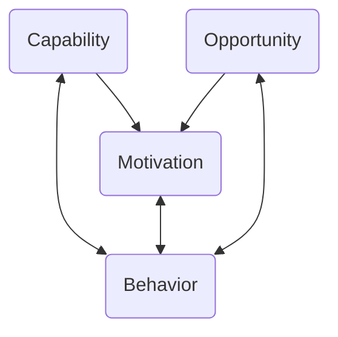
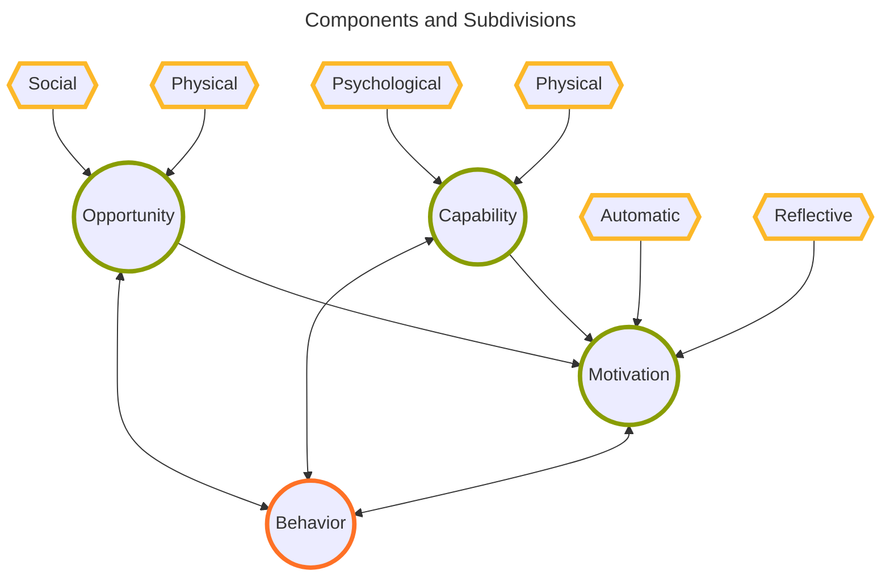

The [[The Behavior Change Wheel (Michie, Susan, et al 2011)| COM-B framework]] breaks a behavior change intervention into 3 components which encapsulate factors that influence behavior. These 3 are then each broken down into 2 subdivisions each.

| Component   | Subdivision   | Achieved by                                              | Examples                                  |
| ----------- | ------------- | -------------------------------------------------------- | ----------------------------------------- |
| Capability  | Physical      | physical skill development                               | training, prostheses, surgery             |
| Capability  | Psychological | knowledge, understanding                                 | skill learning, meds                      |
| Motivation  | Automatic     | positive/negative feelings, impulses, and counter-pulses | habit formation, meds, imitative learning |
| Motivation  | Reflective    | eliciting positive/negative feelings                     | imparting knowledge                       |
| Oppertunity | Social        |                                                          | environment change                        |
| Oppertunity | Physical      |                                                          | environment change                        |

